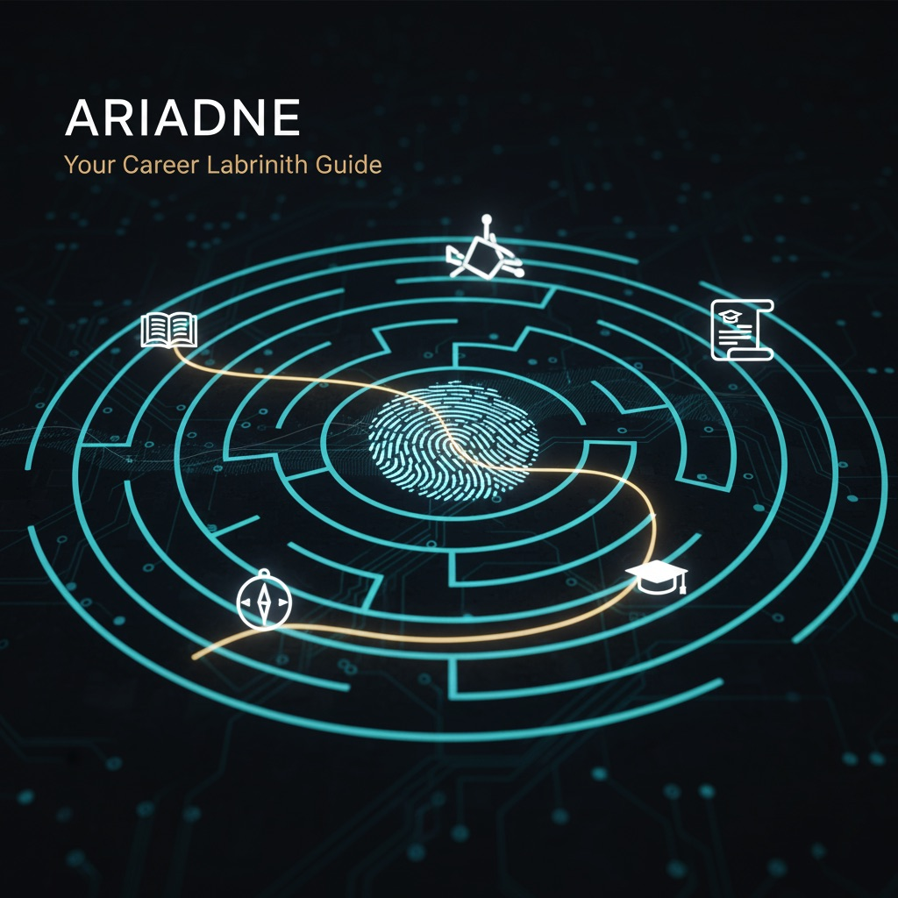

# Ariadne

  

## Project Overview
Ariadne is an advanced AI-driven platform designed to navigate students through the complexities of career planning. By leveraging Brainography impact reports, the system transforms biometric data—specifically fingerprint ridge counts and patterns—into actionable student portfolios and highly personalized career roadmaps. The platform serves as a "Career Labyrinth Guide," providing a clear path from innate potential to professional realization through a multi-agent AI architecture.

## Problem Statement
* Students often struggle to identify their natural strengths and align them with the rapidly evolving job market.
* Traditional career counseling frequently relies on subjective self-assessment, which can be influenced by external pressures or temporary interests.
* This lack of objective, data-driven guidance leads to mismatched career choices, academic burnout, and underutilized potential.

## Solution Approach
Ariadne employs a scientific approach by analyzing "Brainography" data derived from fingerprint patterns that correlate with cognitive tendencies.
* **Biometric Analysis**: Inputs ridge counts and patterns to identify dominant thinking patterns and quotients.
* **Multi-Agent Workflow**: A system of Supervisor, Generator, and Validator agents ensures report sections are factually consistent and tailored to specific academic boards and age levels.
* **Structured Output**: AI-generated insights are converted into professional Word documents with structured tables for easy interpretation.

## Key Features
* **Personalized Skill Prioritization**: Analyzes 10 key skill areas including Strategy, Execution, Intellect, and Observation based on percentage-based dominance.
* **Dynamic Roadmap Generation**: Creates 3-year academic and non-academic intervention plans with month-by-month activities.
* **Context-Aware Recommendations**: Adapts career advice based on the student's educational board and current standard.
* **Automated Validation**: Integrated Validator agent checks content for quality, required categories, and direct relevance to selected career roles.

## System Workflow
1. **Input Collection**: Student profile data, quotients (IQ, EQ, CQ, SQ), and fingerprint-derived skill percentages are gathered.
2. **Orchestration**: The Supervisor Agent determines the necessary report sections based on whether a "Career" or "Development" report is required.
3. **Generation**: The Section Generator Agent creates content using GPT-4o, strictly adhering to the student's entered career roles.
4. **Validation**: The Validator Agent audits the content; if it fails quality checks, a retry mechanism is triggered.
5. **Finalization**: Validated sections are assembled and converted into a formatted .docx file for the user.

## Tech Stack
* **Backend**: Flask (Python)
* **AI Orchestration**: LangGraph, OpenAI GPT-4o
* **Document Processing**: python-docx
* **State Management**: TypedDict (Python)
* **Frontend**: HTML5, CSS3, JavaScript

## Use Cases
* **Students**: Gain a data-backed understanding of their innate strengths and a clear monthly plan to achieve their goals.
* **Parents**: Receive objective insights into their child's potential to better support their academic and personal growth.
* **Educators**: Access detailed academic intervention strategies to tailor teaching methods to a student's learning style.
* **Institutions**: Deploy a standardized, high-tech career guidance tool that enhances placement success and student satisfaction.

## White-label Capability
Ariadne is built with modularity in mind, allowing educational consultancies and schools to integrate their own branding. The report generation engine supports custom headers, color schemes, and specialized "Blueprints" to match specific institutional requirements or regional educational standards.

## Future Enhancements
* **Direct Biometric Integration**: API-based scanning for real-time ridge count analysis.
* **Live Progress Tracking**: A dashboard for students to check off monthly intervention tasks.
* **Market Integration**: Real-time salary and job demand data feeds to update career progression tables dynamically.
* **Multilingual Support**: Generating reports in regional languages to increase accessibility.
